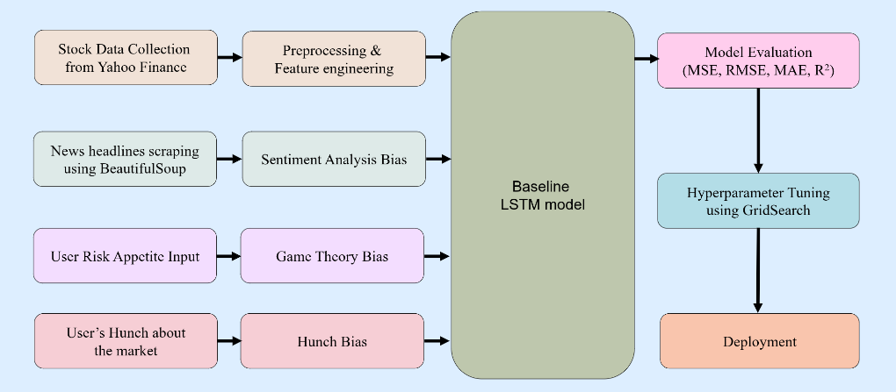

# Game-Theory-Based-Stock-Price-Prediction
We started off a baseline LSTM model, and we are inserting different biases - 1. News sentiment bias, 2. Game Theory Bias, 3. User Hunch Bias.
# Stock Price Predictor with LSTM and Game Theory Biases

## Overview

This project combines advanced machine learning techniques, including Long Short-Term Memory (LSTM) networks and Game Theory-based biases, to predict stock prices. Additionally, sentimental analysis of news headlines and major global events is incorporated to provide a comprehensive understanding of market dynamics.

## Table of Contents

- [Introduction](#introduction)
- [Key Features](#key-features)
- [Methodology](#methodology)
- [Results](#results)
- [Usage](#usage)
- [Installation](#installation)
- [Contributing](#contributing)
- [License](#license)

## Introduction

In financial markets, predicting stock prices is a challenging task. This project aims to enhance prediction accuracy by combining LSTM networks with Game Theory-based biases and sentimental analysis of news headlines. The inclusion of major event biases further refines the model, offering a holistic approach to stock market prediction.

## Key Features

- **LSTM-Based Prediction:** Utilizes LSTM networks for capturing intrinsic statistical trends in time series stock data.
- **Game Theory-Based Biases:** Incorporates biases derived from speculators' optimal strategies, assessing risk appetite and its influence on market behavior.
- **Sentimental Analysis:** Analyzes news headlines for sentiment biases, offering insights into external factors impacting stock prices.
- **Major Event Biases:** Considers major global events like the COVID-19 pandemic, geopolitical conflicts, and employee layoffs, assessing their impact on market sentiments.

## Methodology

- **Data Collection:** Gathers stock prices from Yahoo Finance API and integrates major event data from reliable sources.
- **LSTM Training:** Trains the LSTM model on historical stock data to learn intrinsic statistical trends.
- **Game Theory Biases:** Calculates biases based on speculators' optimal strategies and risk assessments.
- **Sentimental Analysis:** Scrapes news headlines and performs sentiment analysis to quantify external sentiment biases.
- **Major Event Biases Integration:** Incorporates major event biases into the predictive model.

## Results


### Before Incorporating Biases:
- RMSE: 5.45
- MSE: 18.95
- MAE: 3.81
- R2 Score: 0.89

### After Incorporating Biases:
- RMSE: 3.29
- MSE: 10.87
- MAE: 2.36
- R2 Score: 0.99

## Usage

1. Clone the repository.
2. Install the required dependencies.
3. Follow the provided notebooks or scripts for training and prediction.

## Installation

```bash
pip install -r requirements.txt
